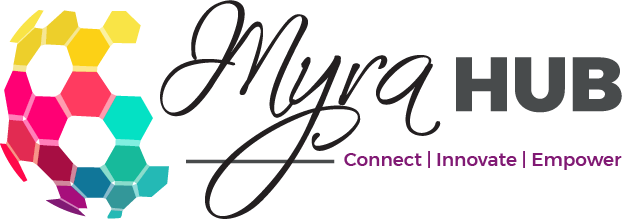
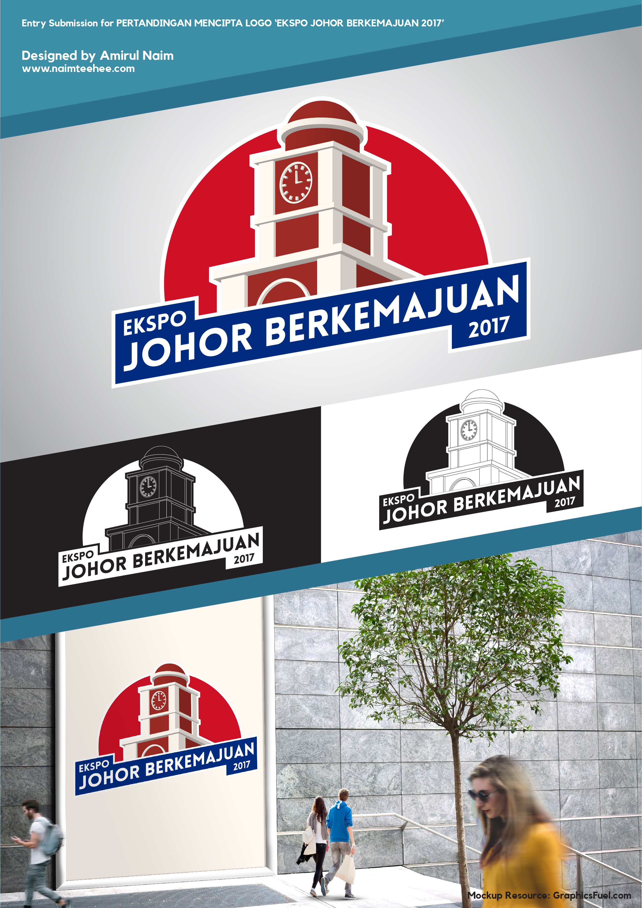
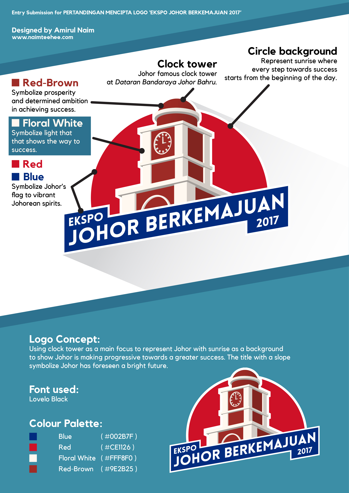
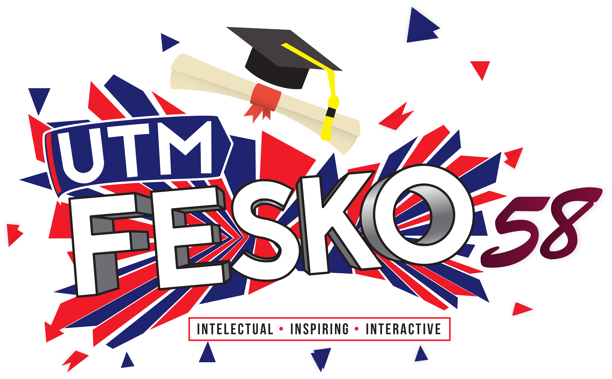

Assalamualaikum!

Since study in Universiti Teknologi Malaysia (UTM) Skudai, various activities/association I have joined such as marathon, pratice silat martial art with [Persatuan Seni Silat Gayung UTM](https://www.facebook.com/pssgutm) and handle [FESKO](https://twitter.com/fesko_utm) event but I can say that I'm quite an introvert person 😅 not very much into social event, so I spend most of my free time stay at the dorm.

With this, I got opportunity to explore on Adobe Photoshop and Illustrator software. All of tutorial and techniques I was inspired by a few Youtube channel:

- [Will Paterson](https://www.youtube.com/channel/UCIp9sEZiv36cDG7cEnrVU7Q)
- [tutvide](https://www.youtube.com/channel/UCeR7U67I2J1icV8E6Rn40vQ)
- [Flux Academy](https://www.youtube.com/@FluxAcademy)

Thus, I would like to highlight some of the design work for inspiration.

---

### During internship

In my early journey as intern at [RN Technologies](https://rntechnologies.com.my/), I have been given task to design logo for their new initiative which are [i-Cloud](https://icloud.rntechnologies.com.my/) and [MyraHub](http://myrahub.com/).

i-Cloud allow businesses grow faster on the simple, affordable cloud server. The logo is presenting the name itself, the 'C' shape spiral surround on 'i' with a gap at the bottom with yellow and blue color shade.

However, MyraHub Foundation is a Malaysian non-profit organization (NGO) based in Johor Bahru which actively promotes social developments and support corporate responsibility initiatives to various programs. Thus I wish to make a globe with technological effect but my boss want it to be simple, so I just add the 'Myra Hub' name with it's slogan at the bottom.

---

### Joined logo design competition

Other than design logo during my internship, I also take up another challenge in Ekspo Berkemajuan Johor in 2017, where I won a consolation prize of RM500. This event focuses on 12 Johor aspirations which are Johor Prihatin, Johor Selamat, Johor Berbudaya, Johor Islamik and Perumahan Johor.

The logo was inspired by Sultan Abu Bakar State Mosque, one of the most famous places of worship in Malaysia because of its status as the state mosque of Johor and its exquisite beauty. 

---

### For top event in UTM

My proudest logo design would be for Festival Konvokesyen Ke-58 UTM. The festival were organized by students  to celebrate graduation day, in addition to shaping the entrepreneurial nature and self-confidence among students. The idea of this logo is to have confetti and graduation hat throw up in the sky. The color of the logo is representing Johor's state color which are red and blue, I admit this is good color combination.

---

In the end, I have share all of my work in [Instagram](https://www.instagram.com/naimteehee/). This account is inactive state, so I may not respond in Instagram's DM.

That will be all for today. See you later!